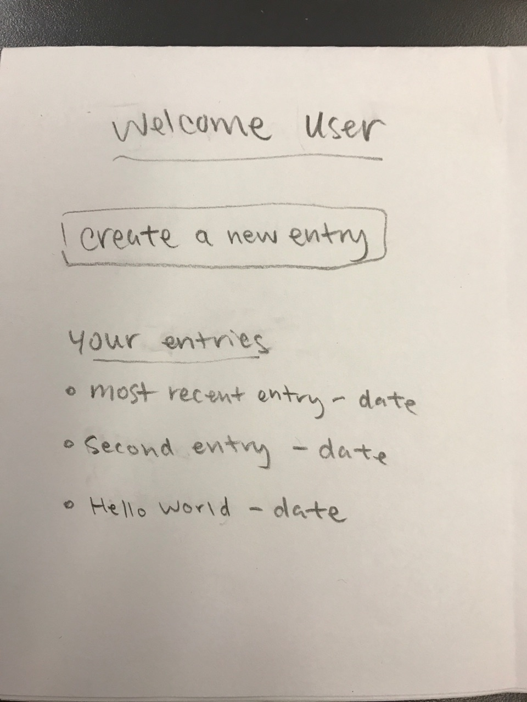
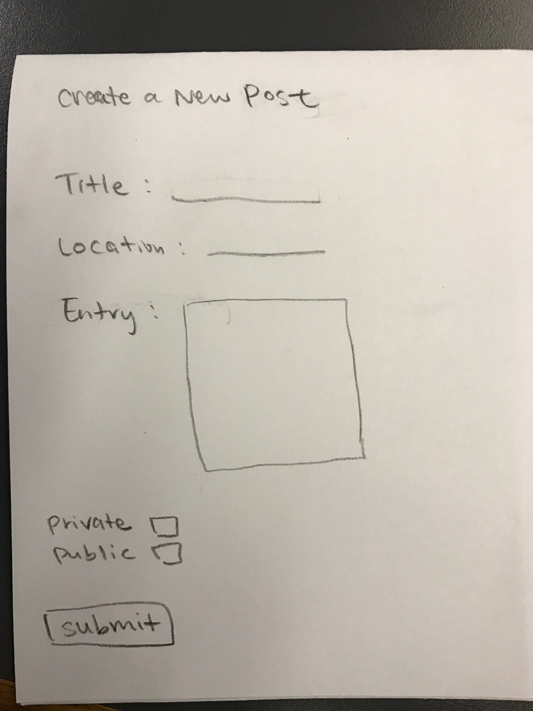
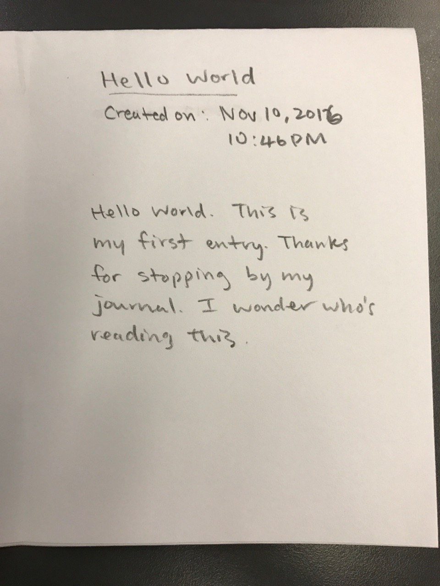
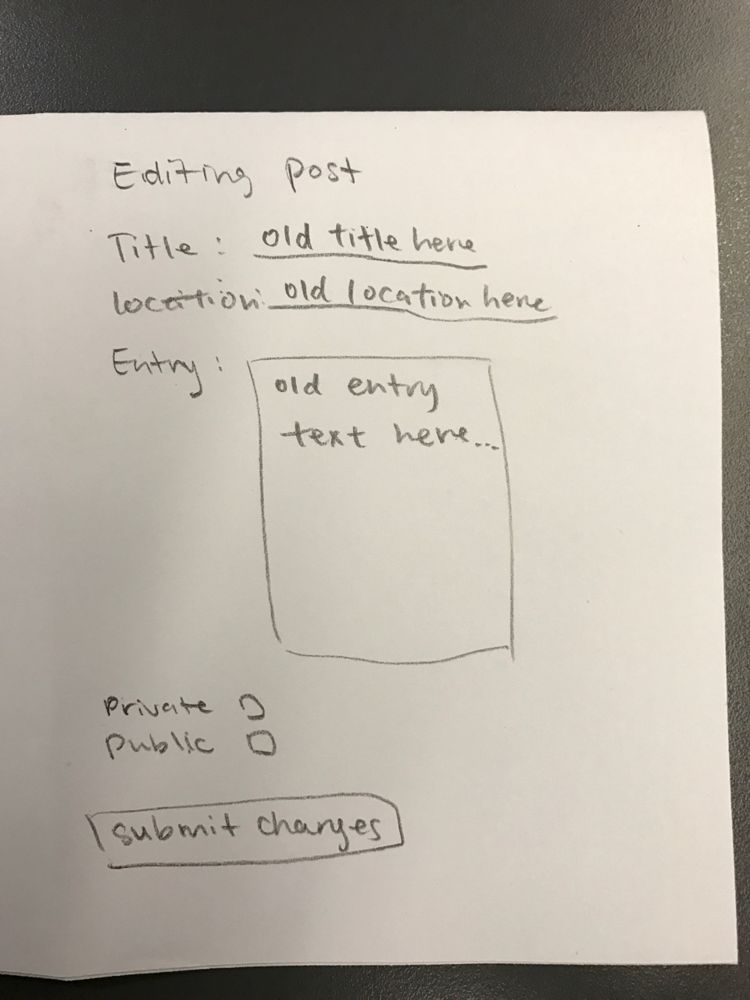
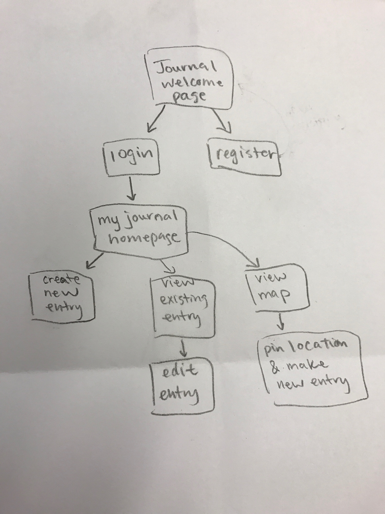

# Journal WebApp
## Overview
This online Journal lets you keep record of little notes, or long notes, if you prefer. You can write about your day, your angst, or anything at all!

Users can register and login. Once they have an account, they can create entries in their journals and edit previous posts. Users can set their entries to be public, which means they can be seen by anyone looking at the site. By defualt, posts are private unless specifically set as public. Private means only the user who created the post will be able to see it. You can still view public jounral entries even if you aren't logged in or if you don't have an account.

Users can also edit their profile to include a bio. Their profile page will also show some statistics regarding how many words they've typed, etc.

Tell your Journal all the things you're too embarassed to tell your friends.
## Data Model
We'll store users and posts as Mongoose schemas.
* each User has a username, password, bio, and an array of Posts they've written
* each Post has a title, content, date, private/public, is edited, and author (User)

First draft schema:

```javascript
// users
// * users have a username and password
// * users have a homepage
// * users may have posts or not
var User = new mongoose.Schema({
  // username, password provided by plugin
  posts: [{ type: Schema.Types.ObjectId, ref: 'Post' }],
  bio : { type: String, default: "Welcome to my profile!" },
});

// a post
var Post = new mongoose.Schema({
  author: {type: mongoose.Schema.Types.ObjectId, ref:'User'},
  title: {type: String, required: true},
  date: (type: Date, required: true),
  content: {type: String, required: true},
  public: {type: Boolean, default: false},
  edited: {type: String, default: ""},
});
```

## Wireframes
/journal/my-journal - page for showing user's journal


/journal/my-journal/create - creating new entry


/journal/my-journal/slug - page for showing a specific post


/journal/my-journal/slug/edit - page to edit a specific post


## Site map


## User stories

1. as a user, I can create an account and a journal
2. as a user, I can create an entry in my journal
3. as a user, I can edit an entry in my journal
4. as a user, I can view the entries in my journal and recount memorable memories
5. as a user, I can view other people's entries
5. as a user, I can edit my profile bio
5. as a user, I can view statistics regarding my posts

## Research Topics

* (6 points) Integrate user authentication
    * passport for user authentication
    * register/login/logout functions
* (2 points or more) Bootstrap CSS (and JS)
    * used Bootstrap classes to make a simple & cohesive template
    * included JavaScript/JQuery for additional features

